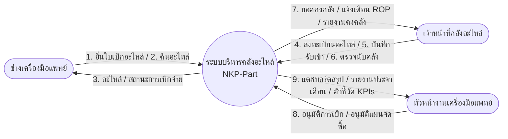
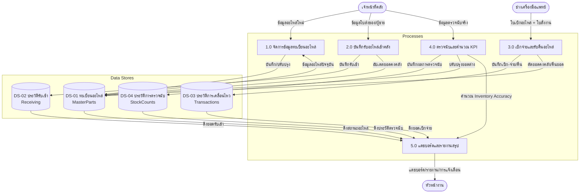
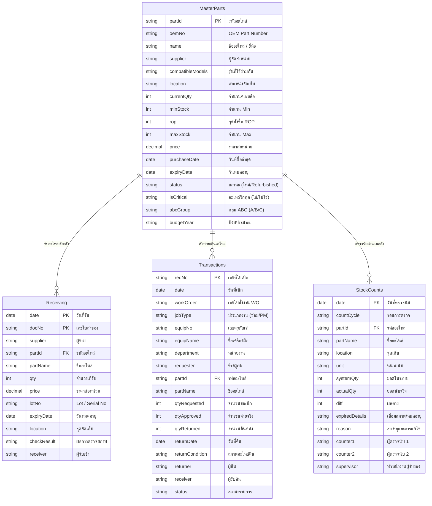

# NKP-Part: ระบบบริหารจัดการคลังอะไหล่เครื่องมือแพทย์ โรงพยาบาลนครพิงค์

ระบบบริหารจัดการคลังอะไหล่เครื่องมือแพทย์ออนไลน์ (**NKP-Part**) พัฒนาขึ้นเพื่อยกระดับการควบคุมคลังอะไหล่ตามระเบียบปฏิบัติมาตรฐาน **WI-MED-007** ของโรงพยาบาลนครพิงค์ โดยย้ายข้อมูลจากเอกสารแบบฟอร์มเดิม (FM-MED-007-01 ถึง 04) มาไว้บนระบบออนไลน์ที่มีการวิเคราะห์แดชบอร์ดสรุปผลและตัวชี้วัด (KPIs) แบบเรียลไทม์

ระบบนี้มีสถาปัตยกรรมแบบ Serverless Static Web Application:
- **Frontend**: พัฒนาด้วย HTML, CSS (Vanilla), และ JavaScript โฮสต์อยู่บน **GitHub Pages**
- **Database Backend**: ใช้ **Google Sheets** เป็นฐานข้อมูล เชื่อมโยงผ่าน API Proxy ด้วย **Google Apps Script**

---

## แผนผังการไหลของข้อมูล (Data Flow Diagrams - DFD)

### DFD Level 0 (Context Diagram)
แสดงขอบเขตความสัมพันธ์ระหว่างระบบและผู้ใช้ภายนอกระบบหลัก ได้แก่ ช่างเครื่องมือแพทย์, เจ้าหน้าที่คลังอะไหล่ และหัวหน้างานเครื่องมือแพทย์

### DFD Level 1
รายละเอียดของ 5 กระบวนการการแลกเปลี่ยนและจัดการข้อมูลในคลังสินค้า

---

## แผนภาพความสัมพันธ์ของข้อมูล (ER Diagram)

โครงสร้างฐานข้อมูลแบ่งออกเป็น 4 ตารางหลักที่เชื่อมต่อกันด้วยความสัมพันธ์แบบ **1-to-Many (1:N)** ผ่านทางฟิลด์ `รหัสอะไหล่` (Foreign Key)

---

## ขั้นตอนการติดตั้งระบบ (Setup Instructions)

### ขั้นตอนที่ 1: การตั้งค่า Google Sheets และ API Web App
1. สร้างไฟล์ **Google Sheet** เปล่าใน Google Drive ของคุณ
2. ไปที่เมนู **Extensions > Apps Script**
3. คัดลอกซอร์สโค้ดทั้งหมดในไฟล์ `google-apps-script/Code.gs` ไปวางในโครงการสคริปต์
4. กดปุ่ม **Deploy > New Deployment** ที่ด้านบนขวา
5. ตั้งค่าการดีพลอยดังนี้:
   - **Select type:** เลือกประเภทเป็น **Web App**
   - **Execute as:** เลือกเป็น **Me** (อีเมล Google ของคุณ)
   - **Who has access:** เลือกเป็น **Anyone** (จำเป็นเพื่อให้หน้าเว็บส่งคำขอผ่าน HTTP Client-side ได้)
6. กดปุ่ม **Deploy** และกดยืนยันสิทธิ์อนุญาตความปลอดภัย (Authorize Access)
7. คัดลอก **Web App URL** ที่ได้ (ตัวอย่าง: `https://script.google.com/macros/s/XXXXX/exec`)

### ขั้นตอนที่ 2: ตั้งค่าใช้งานและทดสอบใน Web Application
1. เปิดหน้าเว็บ NKP-Part Web App (หลังจาก Deploy บน GitHub Pages สำเร็จ)
2. ไปที่แถบเมนู **ตั้งค่าระบบ API** (Sidebar ด้านล่างสุด)
3. วาง Web App URL ที่ได้ลงในช่องกรอกข้อมูล จากนั้นกด **บันทึกการเชื่อมต่อ**
4. กด **ทดสอบการเชื่อมต่อ API** เพื่อให้สคริปต์จำลองสร้างตารางและหัวข้อฐานข้อมูลบน Google Sheets ของคุณอัตโนมัติ
5. เริ่มใช้งานระบบ (เพิ่มอะไหล่หลักในหน้าระเบียน, รับเข้า, และทำการเบิกจ่ายได้ทันที)

---

## การ Deploy เว็บไซต์ออนไลน์ผ่าน GitHub Pages

โปรเจกต์นี้รองรับการ Deploy ไปยัง **GitHub Pages** อัตโนมัติผ่านระบบ **GitHub Actions** ทุกครั้งที่คุณทำรายการ `git push` ไปยังสาขา `main`

### การตั้งค่าเริ่มต้นบน GitHub:
1. ไปที่แท็บ **Settings** ในหน้าคลังเก็บโค้ด (Repository) ของคุณบน GitHub
2. ไปที่เมนู **Pages** ที่เมนูด้านซ้าย
3. ในส่วนของ **Build and deployment > Source** ให้เปลี่ยนค่าเป็น **GitHub Actions**
4. ทุกครั้งที่พุชโค้ด ไฟล์การทำงานใน `.github/workflows/deploy.yml` จะทำการสร้างหน้าเว็บไซต์ออนไลน์ให้อัตโนมัติ
