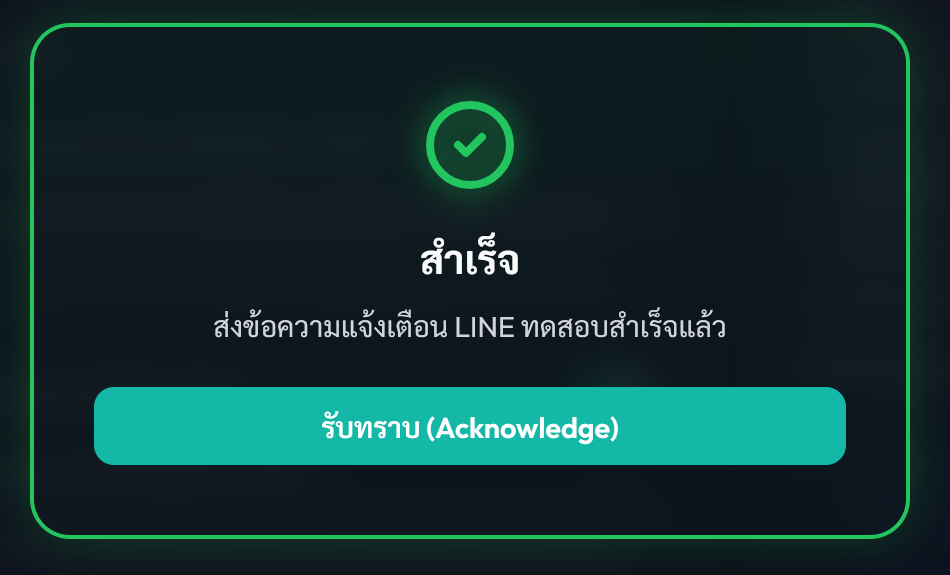
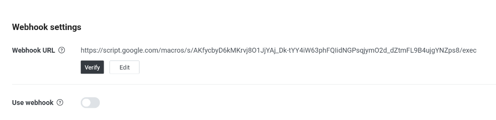
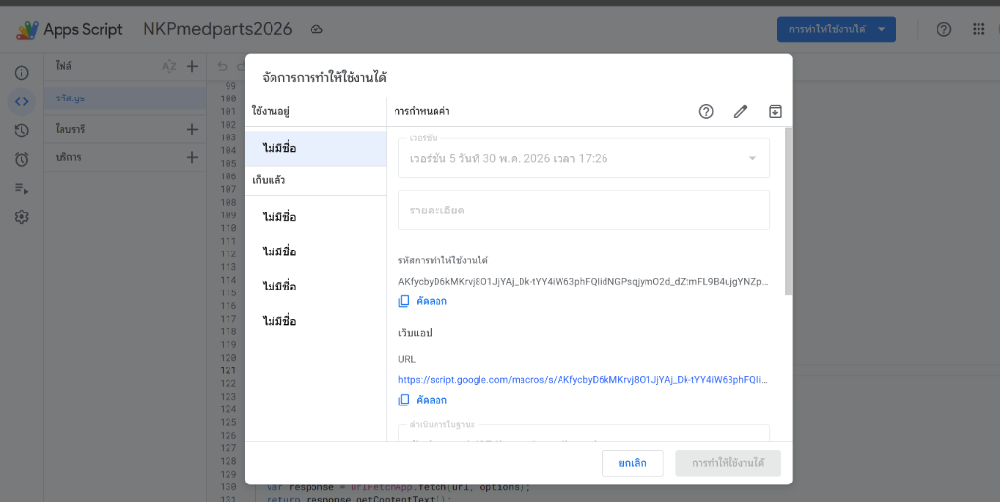
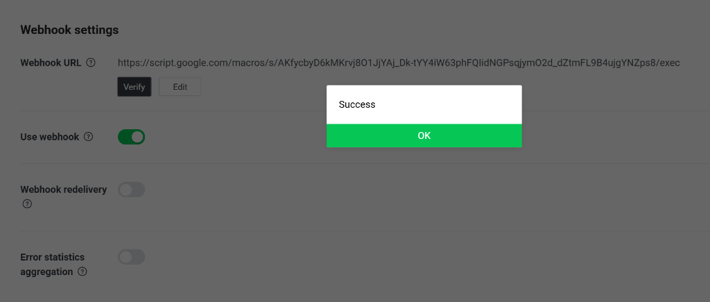
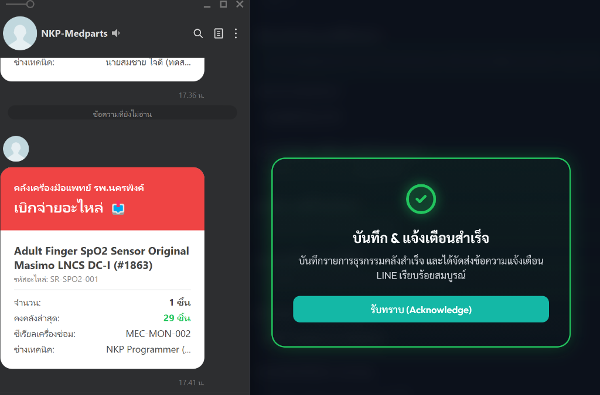

# คู่มือการใช้งานและเอกสารสรุป POC
## ระบบบริหารคลังอะไหล่ศูนย์เครื่องมือแพทย์ โรงพยาบาลนครพิงค์
**เวอร์ชัน 2.0 (อัปเดตระบบสิทธิ์ 3 ระดับ, CSV Import/Export, ระบบเตือนขอบสีนีออน)**

---

## ส่วนที่ 1: บทสรุปการพิสูจน์แนวคิด (POC Summary & Architecture)

ระบบบริหารคลังอะไหล่ศูนย์เครื่องมือแพทย์ โรงพยาบาลนครพิงค์ ได้รับการพัฒนาขึ้นตามสถาปัตยกรรมแบบ **Serverless Web Application** (Single Page Application - SPA) ซึ่งช่วยลดค่าใช้จ่ายในด้านเซิร์ฟเวอร์ฐานข้อมูลและการดูแลรักษาระบบให้เหลือ **0 บาท (ฟรี 100%)** แต่ยังคงสามารถให้บริการระดับองค์กรที่มีความเสถียรและซิงก์ข้อมูลแบบเรียลไทม์ได้จากทุกที่ทั่วโลก

### โครงสร้างระบบ (Architecture Diagram)
1. **หน้าบ้าน (Front-end Web UI):** เขียนด้วย HTML5, Vanilla CSS และ Javascript ทำงานในลักษณะ Client-side ทั้งหมด สามารถโฮสต์ผ่านบริการฟรีของ **GitHub Pages**
2. **ฐานข้อมูลคลาวด์ (Cloud Database Backend):** ใช้ **Google Sheets** ของกลุ่มงานในการจัดเก็บข้อมูลผ่าน **Google Apps Script (GAS)** Web App URL ทำหน้าที่เป็นตัวกลางในการเขียน/อ่านฐานข้อมูล
3. **ระบบแจ้งเตือนด่วน (Real-time Messaging Alert):** ใช้ **LINE Messaging API (LINE OA)** ในการยิงการ์ดข้อความแจ้งเตือน (Flex Message) เข้ากลุ่มแชตของทีมช่างเมื่อเกิดธุรกรรมคลัง

### โครงสร้างตารางฐานข้อมูลใน Google Sheets
เมื่อระบบทำการเชื่อมต่อและซิงก์ข้อมูลเป็นครั้งแรก จะมีตารางชีตถูกสร้างขึ้นใน Google Sheets อัตโนมัติ 3 ชีตหลักดังนี้:
* **ชีต `Parts` (ตารางอะไหล่คงคลัง):** เก็บรายละเอียดอะไหล่ สเปก ตำแหน่งตู้เก็บ ยอดคงคลัง จุด ROP ราคาต่อหน่วย วันซื้อ และวันหมดอายุ
* **ชีต `Transactions` (ตารางบันทึกการเบิกจ่าย):** บันทึกธุรกรรมคลังทั้งหมด (ประเภท, วันเวลา, ผู้ทำรายการ, จำนวน, เลขซ่อม, แผนกใช้งาน, เอกสารอ้างอิง)
* **ชีต `Users` (ตารางรายชื่อและสิทธิ์):** เก็บบัญชีรายชื่อผู้ใช้ รหัสผ่าน ระดับสิทธิ์ สถานะ และจำนวนครั้งที่เข้าสู่ระบบ

---

## ส่วนที่ 2: ระบบความปลอดภัยและระดับสิทธิ์ผู้ใช้ (3-Level Role Security Matrix)

เพื่อจำกัดการแก้ไขข้อมูลคลังและความปลอดภัยขององค์กร ระบบจึงได้รับการออกแบบและแบ่งสิทธิ์ผู้ใช้งานออกเป็น 3 ระดับอย่างชัดเจนดังนี้:

### ตารางเปรียบเทียบสิทธิ์การเข้าถึงเมนูและการใช้งาน (Role Permissions Matrix)

| หน้าจอ / ฟังก์ชันการใช้งาน | ระดับ 1: Programmer | ระดับ 2: Stock Manager | ระดับ 3: General User |
| :--- | :---: | :---: | :---: |
| **1. แดชบอร์ดภาพรวม** | ✅ เข้าถึงได้ | ✅ เข้าถึงได้ | ✅ เข้าถึงได้ |
| **2. คลังอะไหล่และอุปกรณ์** | ✅ เพิ่ม/แก้ไข/ลบ/นำเข้า CSV | ✅ เพิ่ม/แก้ไข/นำเข้า CSV | ❌ **ซ่อนเมนูนี้โดยสมบูรณ์** |
| **3. ทำธุรกรรมเบิกจ่าย/ยืมคืน** | ✅ ทำได้ทุกรายการ | ✅ ทำได้ทุกรายการ | ⚠️ **ทำได้เฉพาะ เบิกจ่าย, ยืม, คืน** |
| **4. ประวัติคลัง (Ledger Logs)** | ✅ ดูได้ & Export CSV | ✅ ดูได้ & Export CSV | ⚠️ **ดูได้ แต่ไม่มีปุ่ม Export CSV** |
| **5. แผนบำรุงรักษาเชิงรุก** | ✅ เข้าถึงได้ | ✅ เข้าถึงได้ | ❌ **ซ่อนเมนูนี้โดยสมบูรณ์** |
| **6. ใบขอจัดซื้ออะไหล่ (PR)** | ✅ เข้าถึงได้ | ✅ เข้าถึงได้ | ❌ **ซ่อนเมนูนี้โดยสมบูรณ์** |
| **7. ระบบจัดการสิทธิ์ผู้ใช้** | ✅ เข้าถึงได้ | ❌ **ซ่อนเมนูนี้โดยสมบูรณ์** | ❌ **ซ่อนเมนูนี้โดยสมบูรณ์** |
| **8. คลาวด์ & LINE Settings** | ✅ เข้าถึงได้ | ❌ **ซ่อนเมนูนี้โดยสมบูรณ์** | ❌ **ซ่อนเมนูนี้โดยสมบูรณ์** |

### รายละเอียดของสิทธิ์แต่ละระดับ

#### 1. Programmer (สิทธิ์ผู้สร้างระบบ)
* **จุดประสงค์:** สำหรับผู้ควบคุมระบบระบบไอที ช่างคอมพิวเตอร์ หรือหัวหน้าแผนกผู้ควบคุมความปลอดภัย
* **ความสามารถหลัก:**
  * มองเห็นเมนูตั้งค่าความปลอดภัยระบบไอทีทั้งหมด (สามารถดู/แก้ไข GAS URL, LINE Token, Group ID)
  * เข้าหน้า **"ระบบจัดการสิทธิ์ผู้ใช้"** เพื่อพิมพ์รายชื่อพนักงานและกดสุ่มสร้างรหัสผ่านพนักงาน รวมถึงการกด "ปิดสิทธิ์" บัญชีช่างที่ย้ายงาน
  * รหัสผ่านเริ่มแรกในการเปิดระบบคือ `NKP-programmer-2026`

#### 2. Stock Manager (สิทธิ์ผู้ดูแลคลัง/ช่างเทคนิคหลัก)
* **จุดประสงค์:** สำหรับช่างหลักผู้ดูแลคลังอะไหล่แพทย์ หรือเจ้าหน้าที่พัสดุศูนย์เครื่องมือแพทย์
* **ความสามารถหลัก:**
  * สามารถจัดการคลังอะไหล่ เพิ่มชิ้นส่วนใหม่ ปรับแก้สเปกอุณหภูมิ ตำแหน่งตู้เก็บ จุดสั่งซื้อ และราคาได้
  * สามารถทำรายการ **รับของเข้าคลัง (Receive)** และ **นับสต๊อกจริง (Audit)** ได้
  * สามารถทำกิจกรรมออกใบเสนอจัดซื้อวัสดุ (PR Generator) ตามพิกัด ROP ได้
  * มองไม่เห็นเมนูจัดการสิทธิ์ผู้ใช้ และเมนูตั้งค่า Google Sheets/LINE

#### 3. General User (สิทธิ์ช่างเทคนิคทั่วไป/ช่างแผนก)
* **จุดประสงค์:** สำหรับช่างทั่วไปที่ทำหน้าที่เบิกอะไหล่ไปซ่อมบำรุงในตึกผู้ป่วยต่าง ๆ เท่านั้น
* **ความสามารถหลัก:**
  * **ความปลอดภัยคลัง:** เมนูแสดงข้อมูลตู้เก็บ ราคาทุน และสถิติต่างๆ ใน "คลังอะไหล่และอุปกรณ์" จะถูก **ซ่อนออกไป** เพื่อความปลอดภัยทางด้านข้อมูลพัสดุ
  * สามารถทำรายการเบิกได้เฉพาะ **"เบิกจ่ายไปซ่อม CM (Issue)"**, **"ยืมเพื่อทดสอบปัญหา (Borrow)"** และ **"คืนของยืม (Return)"** เท่านั้น (โดยจะไม่มีปุ่ม รับเข้าคลัง หรือ ตรวจสอบคลัง แสดงผลในหน้าธุรกรรม)
  * หน้าบันทึกธุรกรรมของช่างทั่วไป จะถูก **ซ่อนช่องกรอก "เอกสารอ้างอิง / รหัสใบงาน"** ❌
  * ในหน้าตารางประวัติคลัง (Ledger Logs) จะดูประวัติได้อย่างเดียว แต่ปุ่ม **"Export CSV" จะถูกซ่อนออกไป** เพื่อความปลอดภัยทางข้อมูล ❌

---

## ส่วนที่ 3: คู่มือการใช้งานระบบทีละเมนู (Detailed Feature Guide)

### 1. แดชบอร์ดภาพรวม (Dashboard)
* **การแสดงผล:** สถิติสรุปยอดรวมอะไหล่, ยอดเงินทุนคลัง, อะไหล่ที่ระดับต่ำเตือนภัย และรายการอะไหล่ที่หมดอายุ
* **สเปกทางเทคนิค:** แผนภูมิวงกลมวิเคราะห์ **ABC Classification** แบบเรียลไทม์ (Class A = อะไหล่มูลค่าสูงมาก คุมเข้มงวดที่สุด, B = ปานกลาง, C = มูลค่าต่ำ)
* **วิเคราะห์ความคุ้มค่าซ่อม:** กราฟดัชนีอัตราส่วนค่าซ่อมสะสมเปรียบเทียบกับราคาเครื่องแพทย์ (**Technical Service Cost / Equipment Value Ratio**) หากอัตราส่วนสูงเกิน 50% ระบบจะแสดงไอคอนเตือนภัยแจ้งว่าชำรุดบ่อย ไม่คุ้มค่าซ่อมบำรุงต่อ ควรพิจารณาแทงจำหน่าย

### 2. คลังอะไหล่และอุปกรณ์ (Catalog) - *เฉพาะสิทธิ์ Programmer และ Stock Manager*
* **การใช้งาน:** แสดงตารางการ์ดรายละเอียดอะไหล่แต่ละชนิด ตำแหน่งการวางในชั้นเก็บ แบรนด์ผู้ผลิต วันหมดอายุ จุด ROP และจำนวนขั้นต่ำ/สูงสุดในการสำรองพัสดุ
* **ระบบการส่งออก/นำเข้าข้อมูล CSV (Catalog CSV Sync):**
  * **การส่งออก (Export CSV):** กดปุ่ม "Export CSV" ระบบจะเซฟตารางอะไหล่ทั้งหมดเป็นไฟล์ CSV ภาษาไทยที่เปิดด้วย Excel ได้ เพื่อนำไปแก้ไขข้อมูลนอกสถานที่
  * **การนำเข้า (Import CSV):** ช่างสามารถนำเข้าข้อมูลอะไหล่ที่อัปเดตยอดสต๊อกหรือแก้ไขข้อมูลจุดสั่งซื้อจากไฟล์ CSV กลับเข้าสู่ระบบได้พร้อมกันในคราวเดียว โดยระบบจะทำการตรวจสอบหัวตาราง หากหัวตารางไม่ตรงตามรูปแบบระบบจะปฏิเสธการทำรายการทันที
  * **การเตือนเขียนทับ (Confirm Overwrite):** การ Import ระบบจะนำข้อมูลในไฟล์มาล้างคลังเดิมและเขียนทับทั้งหมดเพื่อรองรับการลบรายการอะไหล่ โดยจะมีหน้าต่างแจ้งเตือนสีเหลืองโปร่งแสงเรืองแสงนีออนโชว์เตือนให้ช่างกดยืนยันก่อนทำธุรกรรมเสมอ

### 3. ทำรายการสินค้าคงคลัง (Warehouse Transactions)
* **ระบบการป้อนข้อมูลซีเรียลแพทย์:** เปลี่ยนมาเป็นช่องกรอกข้อความอิสระ (Text Input) เพื่อให้ช่างแพทย์พิมพ์รหัสครุภัณฑ์ เช่น `6515-003-2101/00038-64` หรือเลข IDNUMBER `MEC-MON-001` ลงในระบบได้อย่างสะดวกตามลักษณะงานจริง
* **ขอบสีเตือนสถานะนีออน (Live Neon Validation styling):**
  * หากช่องข้อมูลสำคัญ (ซีเรียลเครื่องแพทย์, เลขซ่อม 6 หลัก, หน่วยงานที่เบิก) ยังว่างอยู่ หรือใส่ข้อมูลไม่ถูกต้องตามรูปแบบ ระบบจะแสดงขอบเรืองแสง **สีแดงนีออนอ่อน** 🔴 เพื่อเตือนว่าข้อมูลยังไม่สมบูรณ์
  * เมื่อช่างกรอกข้อมูลได้ถูกต้องสมบูรณ์ ขอบของช่องจะสลับเปลี่ยนเป็น **สีเขียวเรืองแสงนีออนอ่อน** 🟢 ทันทีแบบเรียลไทม์
* **เงื่อนไขเลขซ่อม 6 หลัก:** ช่องกรอกข้อมูลเลขซ่อม/เลขใบแจ้งซ่อม (`#tx-repair-no`) จะต้องเป็นตัวเลข 6 หลักถ้วนเท่านั้น (เช่น `295666`) ขอบช่องจึงจะเปลี่ยนเป็นสีเขียวผ่านการรับรอง
* **กล่องหน้าต่างแจ้งเตือนหลังบันทึกรายการ (Glassmorphic Modal Popup):**
  ยกเลิกระบบแจ้งเตือนแบบเก่าที่เด้งขึ้นมาแล้วเลือนหายไปเอง (Auto-fade Toast) เปลี่ยนเป็นกล่องข้อความทรานสปาเรนต์หลังเบลอ (Glassmorphism) ขนาดใหญ่กลางจอภาพ พร้อมปุ่มบังคับให้ผู้ใช้งานกด **"รับทราบ (Acknowledge)"** ก่อนเท่านั้น ข้อความแจ้งเตือนจึงจะหายไป โดยแบ่งออกเป็น 3 ระดับสีตามสถานะการซิงก์:
  * **🟢 สมบูรณ์ (Success - ขอบเขียวนีออน):** ทำการบันทึกฐานข้อมูลคลัง และส่งข้อความ Flex Message แจ้งเตือนเข้าสู่กลุ่ม LINE OA สำเร็จครบถ้วน (หรือบันทึกสำเร็จโดยที่ปิดฟังก์ชัน LINE)
  * **🟡 สมบูรณ์บางส่วน (Warning - ขอบเหลืองนีออน):** ระบบทำการเซฟลงตาราง Google Sheets สำเร็จแล้ว แต่มีข้อขัดข้องทางด้านการเชื่อมต่ออินเทอร์เน็ต/API ทำให้ไม่สามารถยิงแจ้งเตือนเข้ากลุ่ม LINE ได้
  * **🔴 บันทึกข้อมูลล้มเหลว (Danger - ขอบแดงนีออน):** เกิดข้อผิดพลาดของข้อมูล หรือตรวจสอบสิทธิ์ล้มเหลว ทำให้ไม่สามารถบันทึกธุรกรรมลงในระบบคลังได้เลย

### 4. ประวัติคลัง (Ledger Logs)
* **การใช้งาน:** แสดงตารางประวัติธุรกรรมคลังสินค้าเรียงตามลำดับเวลาล่าสุด ช่างสามารถค้นหาตามช่วงเวลา ประเภทรายการ หรือคีย์เวิร์ดได้
* **การล็อกผู้ทำธุรกรรม:** ทุกการบันทึกธุรกรรม ระบบจะเก็บชื่อจริง (`realName`) และระดับสิทธิ์ของผู้ใช้งานในขณะนั้นลงไปในแถวประวัติโดยอัตโนมัติ ช่างทั่วไปจึงไม่สามารถกรอกชื่อปลอมหรือสวมสิทธิ์แทนผู้อื่นได้

### 5. ใบขอจัดซื้ออะไหล่ (Purchase Request Generator) - *เฉพาะสิทธิ์ Programmer และ Stock Manager*
* **การใช้งาน:** หน้าวางแบบฟอร์มเอกสารบันทึกข้อความราชการเสนอขออนุมัติจัดเตรียมอะไหล่พัสดุแพทย์
* **การทำงานอัจฉริยะ:** ระบบสามารถดึงข้อมูลรายการอะไหล่ที่คงคลังต่ำกว่าเกณฑ์ควบคุม (ROP) ขึ้นมาจัดเตรียมลงแบบฟอร์มให้โดยอัตโนมัติ ช่างสามารถเลือกจำนวนจัดซื้อ ใส่ชื่อประธานกรรมการตรวจรับ และสั่งพิมพ์ออกทางเครื่องปริ้นเตอร์หรือส่งออกเป็นเอกสาร PDF ทางการได้ทันทีในคลิกเดียว

---

## ส่วนที่ 4: คู่มือการตั้งค่าเพื่อเชื่อมต่อระบบใช้งานจริง (Production Cloud Setup)

เพื่อย้ายแอปพลิเคชันจากเวอร์ชันทดลองใช้งาน (Local Mode) เข้าสู่ระบบคลาวด์ใช้งานจริง ให้ทีมโปรแกรมเมอร์และผู้ดูแลระบบทำการเชื่อมต่อตามขั้นตอนดังนี้:

### 1. การเชื่อมต่อคลาวด์หลังบ้าน Google Sheets
1. เปิดหน้าลิงก์ไฟล์ Google Sheet ของคุณ: [Spreadsheet Link](https://docs.google.com/spreadsheets/d/1DFSlfL3lCIdNbmkqLG-5ymRb9O6l8n8u0W_f3ZZBtUQ/edit?usp=sharing)
2. คลิกเมนู **ส่วนขยาย (Extensions)** -> เลือก **Apps Script**
3. ลบโค้ดเริ่มต้นออกให้หมด และเปิดไฟล์ **[code.gs](file:///d:/Antigravity/NKPmedparts2026/code.gs)** คัดลอกโค้ดทั้งหมดในนั้นมาวางใส่ลงใน Apps Script
4. กดบันทึกการทำงาน จากนั้นคลิกปุ่ม **การทำให้ใช้งานได้ (Deploy)** -> **การทำให้ใช้งานได้ใหม่ (New deployment)**
5. เลือกประเภทการเผยแพร่เป็น: **เว็บแอป (Web app)** และกำหนดสิทธิ์ผู้เข้าใช้งานเป็น: **"ทุกคน (Anyone)"** จากนั้นกดปุ่ม Deploy
6. คัดลอกลิงก์ **เว็บแอป URL (Web app URL)** ที่ระบบให้มาเพื่อนำมาใส่ในหน้าเว็บแอปพลิเคชัน

### 2. การกำหนดค่าในหน้าเว็บแอปพลิเคชัน
1. ล็อกอินเข้าระบบด้วยสิทธิ์ **Programmer** (รหัสผ่านเริ่มแรกคือ `NKP-programmer-2026`)
2. ไปที่เมนู **"คลาวด์ & LINE Settings"** 
3. วางลิงก์เว็บแอปที่ก๊อปปี้มาลงในช่อง **"Google Apps Script Web App URL"** 
4. ใส่ **LINE Bot Token (Channel Access Token)**
5. ทำการกดยืนยันบันทึกการตั้งค่า

### 3. การดึง LINE Group ID / User ID และตั้งค่า Webhook (หมดห่วงเรื่องหา ID ไม่เจอ)
เนื่องจากการส่งข้อความทาง LINE OA (Messaging API) จำเป็นต้องระบุรหัสประจำตัวของห้องแชต (User ID สำหรับคุยเดี่ยว หรือ Group ID สำหรับส่งเข้ากลุ่ม) ซึ่งไม่สามารถดูได้จากแอปทั่วไป ระบบจึงได้เตรียมชุดอำนวยความสะดวกสำหรับบันทึก ID ไว้ดังนี้:

1. นำ **เว็บแอป URL (Web app URL)** ที่ได้จาก Apps Script ในส่วนที่ 1 ไปใส่ในหน้า **LINE Developers Console** ของบอทท่าน:
   * เข้าสู่ระบบ LINE Developers -> ไปที่หน้าการตั้งค่าบอทของคุณ -> แท็บ **Messaging API**
   * หาหัวข้อ **Webhook URL** จากนั้นวางลิงก์เว็บแอป URL ลงไป แล้วกดบันทึก (Save)
   * กดเปิดใช้งานสวิตช์ **Use Webhook** 🟢

2. **วิธีการหา ID จาก Google Sheets:**
   * ให้ผู้ใช้เพิ่มบอทเป็นเพื่อน (คุย 1-ต่อ-1) หรือทำการดึงบอท (LINE OA) เข้าไปในกลุ่มแชตของทีมช่าง
   * พิมพ์คำใดก็ได้ส่งแชตหาบอท (เช่น ส่งคำว่า "ทดสอบระบบ")
   * บอทจะทำการตรวจสอบและนำ ID นั้นมาเขียนบันทึกไว้ใน Google Sheet ของคุณ ในชีตใหม่ชื่อ **`LINE_IDs`** โดยอัตโนมัติ!
   * เปิด Google Sheets ไปที่ชีต **`LINE_IDs`** แล้วก๊อปปี้ค่า ID ที่ขึ้นต้นด้วย `U...` (สำหรับผู้ใช้เดี่ยว) หรือ `C...` (สำหรับกลุ่มแชต) มาวางลงในช่อง **"LINE Group ID / User ID"** ในหน้าตั้งค่าแอปพลิเคชัน แล้วกดยืนยันบันทึก

### 4. การตรวจสอบสถานะและแก้ไขปัญหาการแจ้งเตือน (Debugging LINE Notification)
เมื่อทำรายการเบิกจ่ายคลังแล้วข้อความยังไม่ขึ้นเตือนในห้องแชต ให้ตรวจสอบความผิดพลาดได้ง่ายๆ ดังนี้:
1. เปิดไฟล์ Google Sheet ของคุณ ไปดูที่ตารางชีตชื่อ **`LINE_Logs`** ที่ระบบสร้างขึ้นมาให้โดยอัตโนมัติ
2. สังเกตช่อง **"ผลการทำงาน"** ของแต่ละแถวส่งข้อความ:
   * **ส่งสำเร็จ:** การเชื่อมต่อ LINE API สมบูรณ์
   * **ล้มเหลว (พร้อมรายละเอียดข้อผิดพลาด):** ระบบจะโชว์เหตุผลที่ทำให้การส่งไม่ถึงปลายทาง เช่น:
     * `{"message":"The property, 'to', is invalid..."}` -> แสดงว่าใส่ค่า ID ในช่องตั้งค่าไม่ถูกต้อง (ต้องดึง ID แท้จริงจากชีต `LINE_IDs` เท่านั้น)
     * `{"message":"Invalid access token"}` -> แสดงว่าคัดลอก Token มาไม่ครบถ้วน หรือทำสิทธิ์หายระหว่างทาง
     * หากบอทไม่ได้อยู่ในกลุ่มแชต ก็จะแสดงสถานะจัดส่งล้มเหลวจากตัว LINE API เช่นกัน ให้ทำการดึงบอทเข้ากลุ่มก่อนใช้งาน
3. ช่างคอมพิวเตอร์ยังสามารถเปิดดูบันทึกเหตุการณ์แบบเรียลไทม์ได้จากเมนู **"ประวัติการเรียกใช้งาน" (Executions)** บนแถบด้านซ้ายมือของหน้า Apps Script เพื่อดูประวัติการร้องขอแบบเจาะลึกได้อีกด้วยครับ

---

## ส่วนที่ 5: ผลการทดสอบและการแจ้งเตือนบน LINE OA ประสบความสำเร็จจริง

เมื่อทำการเชื่อมโยงข้อมูลทั้งในส่วนของ Google Sheet Web App และเปิดใช้งาน Webhook และกรอกรหัสแชตได้อย่างถูกต้องแล้ว เมื่อช่างทำการเบิกจ่ายอะไหล่ในคลัง รายการจะถูกบันทึกสำเร็จลงฐานข้อมูล Sheets พร้อมแจ้งเตือนส่ง Flex Message ตรงเข้ามือถือของทีมช่างได้ทันที:

